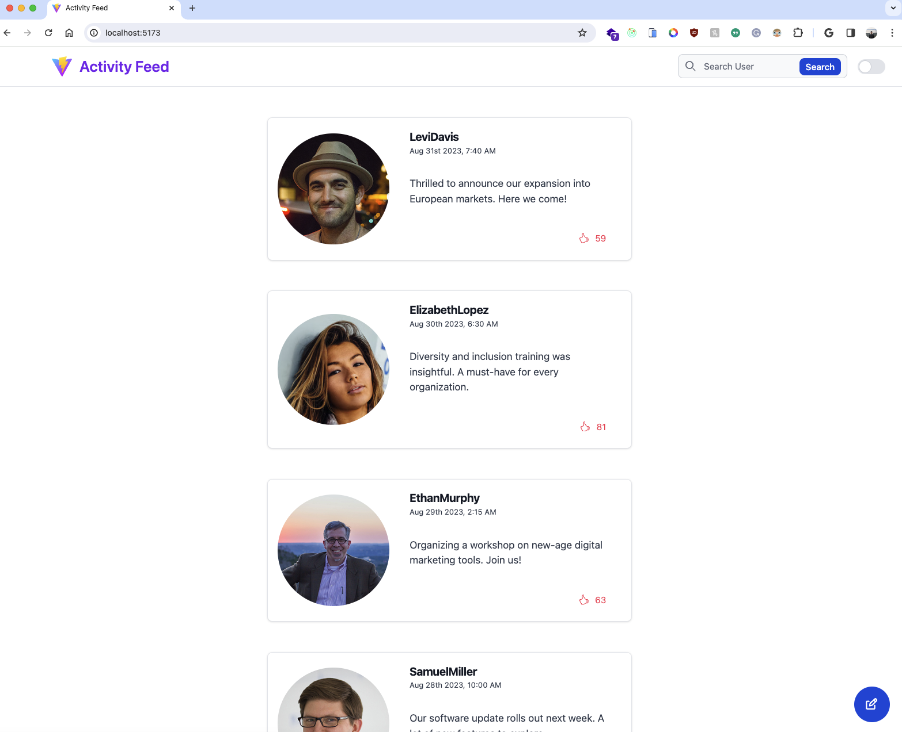

# Activity Feed

## How to auto start all services - One command to rule them all!
```
docker-compose up
```

## How to manually start services

### 1. Start DB
Start your own DB on localhost:5432

### 2. Start Backend API
```
cd backend
npm install
```

#### Setup the database and apply all migrations + seed data
```
npx prisma migrate reset
```

#### How to run test
```
npm run test
```

#### How to start the API
```
npm run dev
```

### 3. Start Frontend UI
```
cd frontend
npm install
npm run dev
```

 